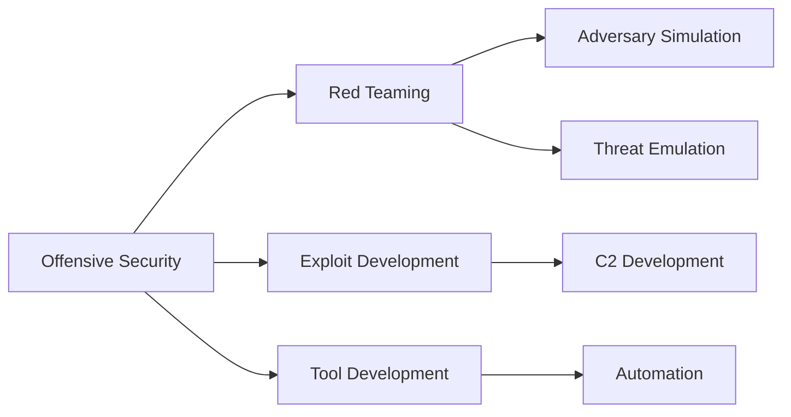

<div align="center">

# 🎯 ANAS LABRINI

### `Red Team Specialist` • `Offensive Security Engineer` • `Tool Developer`


[](https://github.com/anaslabrini)
[](https://github.com/anaslabrini)
[](https://github.com/anaslabrini)
[](https://github.com/anaslabrini)


</div>

---

## 🔴 `whoami`

```python
#!/usr/bin/env python3

class RedTeamSpecialist:
    def __init__(self):
        self.name = "Anas Labrini"
        self.role = "Offensive Security Engineer"
        self.expertise = [
            "Adversary Simulation",
            "Exploit Development", 
            "Post-Exploitation Engineering",
            "C2 Development",
            "Security Automation"
        ]
        self.location = "Morocco 🇲🇦"
        
    def current_focus(self):
        return {
            "learning": ["Advanced C2 Implants", "Cloud Attack Simulation"],
            "building": ["Custom Offensive Tooling", "Red Team Infrastructure"],
            "improving": ["Detection Evasion", "Persistence Mechanisms"]
        }
    
    def philosophy(self):
        return "Master the attack to strengthen the defense 🎯"
```

<details>
<summary>📡 <b>Attack Surface</b></summary>

```bash
→ Reconnaissance (Passive & Active)
→ Initial Access & Exploitation
→ Privilege Escalation (Linux/Windows)
→ Lateral Movement & Pivoting
→ Credential Harvesting
→ Persistence Mechanisms
→ Post-Exploitation Operations
→ C2 Infrastructure & Operations
→ Web Application Attacks
→ Network Penetration
→ Social Engineering & Phishing
→ Threat Emulation (MITRE ATT&CK)
```

</details>

---

## ⚡ `Skills Matrix`

<table>
<tr>
<td width="50%">

### 🐧 **Systems**
```yaml
Primary:
  - Kali Linux
  - ParrotOS
  - Ubuntu Server
```

### 💻 **Languages**
```yaml
Offensive:
  - Python (Advanced)
  - Bash (Expert)
  - PowerShell
```

</td>
<td width="50%">

### 🛠️ **Arsenal**
```yaml
Frameworks:
  - Metasploit
  - Cobalt Strike
  - Empire / Sliver
  
Network:
  - Nmap / Masscan
  - Wireshark / Tcpdump
  - Bettercap / Responder
```

</td>
</tr>
</table>

---

## 🎯 `Custom Arsenal` — Tools I've Built

<div align="center">

| Tool | Description | Tech Stack |
|:-----|:------------|:-----------|
| **[AnasC2](https://github.com/anaslabrini/AnasC2)** | Python-based Command & Control Framework | `Python` `C2` `Post-Exploitation` |
| **[AnasSSHoney](https://github.com/anaslabrini/AnasSSHoney)** | SSH Honeypot System | `Python` `Deception` `Threat Intel` |
| **[AnasShadowCheck](https://github.com/anaslabrini/AnasShadowCheck)** | Advanced Misconfiguration & Header Analysis | `Python` `WebSec` `Recon` |
| **[AnasHunter](https://github.com/anaslabrini/AnasHunter)** | Target Profiling & Enumeration Engine | `Python` `OSINT` `Automation` |
| **[AnasOsint](https://github.com/anaslabrini/AnasOsint)** | Automated OSINT Collection Framework | `Python` `Intel` `Recon` |
| **[AnasRecon](https://github.com/anaslabrini/AnasRecon)** | Reconnaissance Automation Framework | `Bash` `Python` `Scanning` |
| **[AnassRedTool](https://github.com/anaslabrini/AnassRedTool)** | Multi-Layer Offensive Toolkit | `Python` `Multi-Tool` `RedTeam` |

</div>

---

## 🔥 `Offensive Toolbox`

<div align="center">

### Exploitation & Post-Exploitation


### Network & Recon


### Web Attacks


### Password & Credential Attacks


### Active Directory


### OSINT


</div>

---

## 📊 `Statistics`

<div align="center">
  


</div>

---

## 🎓 `Certifications & Learning Path`



---

## 📡 `Connect`

<div align="center">

[](https://github.com/anaslabrini)
[](mailto:your.email@example.com)
[](https://linkedin.com/in/yourprofile)

</div>

---

<div align="center">

### 💀 *"In the world of ones and zeros, I find the vulnerabilities others miss."* 💀


**⚡ Remember: This profile is for educational and authorized security testing only ⚡**

</div>
